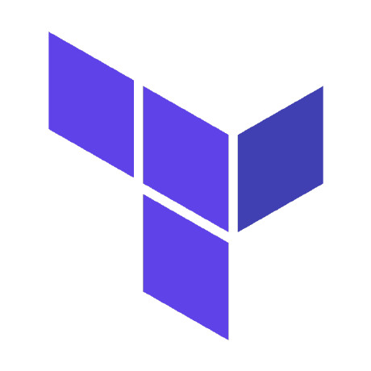

[![LinkedIn][linkedin-badge]][linkedin-url]
[![Instagram][instagram-badge]][linkedin-url]
[![Gmail][gmail-badge]][gmail-url]
[![Counter][counter-badge]][counter-url]

 

## :raising_hand: Hello / Olá
🇧🇷 `Olá, meu nome é Esmael, tenho 28 anos e sou supervisor de TI. Estou buscando por uma transição de carreira para DevOps. Essa conta é um laboratório de estudos, idéias e recursos para mim e outros desenvolvedores que compartilham o mesmo objetivo de produzir algo útil.`

🇺🇸 `Hello my name is Esmael, I'm 28 years old and I'm an IT supervisor. I'm looking for a career transition to DevOps. This account is a research lab, ideas and resources for me and other developers who share the same goal of making something useful.`

 

## :rocket: Interesses (*Interests*)
> 🇧🇷 Ferramentas, linguagens e outras coisas que tenho interesse:

> 🇺🇸 Tools, languages, and other things that I'm interested in:

<table>
  <tr>
    <td align="center"><a href="https://devops.com/"> <b>DevOps</b></a></td>
    <td align="center"><a href="https://git-scm.com/"> <b>Git</b></a></td>
    <td align="center"><a href="https://www.ansible.com/"> <b>Ansible</b></a></td>
    <td align="center"><a href="https://kernel.org/"> <b>Linux</b></a></td>
    <td align="center"><a href="https://www.python.org/"> <b>Python</b></a></td>
    <td align="center"><a href="https://go.dev/"> <b>Go</b></a></td>
    <td align="center"><a href="https://www.jenkins.io/"> <b>Jenkins</b></a></td>
  </tr>
  <tr>
    <td align="center"><a href="https://www.shellscript.sh/"> <b>Shell Scripting</b></a></td>
    <td align="center"><a href="https://kubernetes.io/"> <b>Kubernetes</b></a></td>
    <td align="center"><a href="https://www.docker.com/"> <b>Docker</b></a></td>
    <td align="center"><a href="https://prometheus.io/"> <b>Prometheus</b></a></td>
    <td align="center"><a href="https://aws.amazon.com/"> <b>AWS</b></a></td>
    <td align="center"><a href="https://www.terraform.io/"> <b>Terraform</b></a></td>
    <td align="center"><a href="https://www.chef.io/"> <b>Chef</b></a></td>
  </tr>
  <tr>
    <td align="center"><a href="https://puppet.com/"> <b>Puppet</b></a></td>
  </tr>
</table>

 

## :octocat: Estatísticas (*Stats*)

  
  

  
  

[linkedin-badge]: https://img.shields.io/badge/LinkedIn-282A36?style=for-the-badge&logo=linkedin&logoColor=white&link
[linkedin-url]: https://www.linkedin.com/in/calimanfilho/
[instagram-badge]: https://img.shields.io/badge/Instagram-282A36?style=for-the-badge&logo=instagram&logoColor=white
[instagram-url]: https://www.instagram.com/calimanfilho/
[gmail-badge]: https://img.shields.io/badge/Gmail-282A36?style=for-the-badge&logo=gmail&logoColor=white
[gmail-url]: mailto:calimanfilho@gmail.com
[medium-badge]: https://img.shields.io/badge/Medium-282A36?style=for-the-badge&logo=medium&logoColor=white
[medium-url]: https://medium.com/@calimanfilho
[counter-badge]: https://komarev.com/ghpvc/?username=calimanfilho&color=282A36&style=for-the-badge
[counter-url]: https://github.com/calimanfilho

<!--
*** As cores padrões de cada rede social são:
*** LinkedIn-0077B5
*** Instagram-E4405F
*** Gmail-D14836
*** Medium-12100E
*** https://www.markdownguide.org/basic-syntax/#reference-style-links
-->
